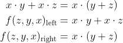

# Lab 1

### 1. De Morgan's laws

   1.1 Equations of all three versions of logic function f(c,b,a):

   
   
   nebo taky
   
   
   
   1.2 Listing of VHDL architecture from design file (`design.vhd`) for all three functions:
   
```vhdl
architecture dataflow of demorgan is
begin
    f_org_o  <= (not(b_i) and a_i) or (not(c_i) and not(b_i));
    f_nand_o <= not (not (not b_i and a_i) and not(not b_i and not c_i));
    f_nor_o  <= (not (b_i or not a_i)) or not (c_i or b_i);
end architecture dataflow;
```

   1.3 Complete table with logic functions' values:

| **c** | **b** |**a** | **f(c, b, a)_ORG** | **f(c, b, a)_NAND** | **f(c, b, a)_NOR** |
| :-: | :-: | :-: | :-: | :-: | :-: |
| 0 | 0 | 0 | 1 | 1 | 1 |
| 0 | 0 | 1 | 1 | 1 | 1 |
| 0 | 1 | 0 | 0 | 0 | 0 |
| 0 | 1 | 1 | 0 | 0 | 0 |
| 1 | 0 | 0 | 0 | 0 | 0 |
| 1 | 0 | 1 | 1 | 1 | 1 |
| 1 | 1 | 0 | 0 | 0 | 0 |
| 1 | 1 | 1 | 0 | 0 | 0 |

### 2. Distributive laws

 2.1 Screenshot with simulated time waveforms:
 
   

 2.2 Link to my public EDA Playground example:

   [L I N K](https://www.edaplayground.com/x/TcqB)

### 3. Experiment

 3.1 Equations.
 
 First:
 
   
   
 Second:
 
   

 3.2 Verifying the Distributive laws in EDA Playground:
 
   ```vhdl
entity gates is
    port(
        a_i     : in  std_logic;         -- Data input
        b_i     : in  std_logic;         -- Data input
        c_i     : in  std_logic;         -- Data input
        fd1l_o  : out std_logic;
        fd1r_o	: out std_logic;
        fd2l_o  : out std_logic;
        fd2r_o	: out std_logic
    );
end entity gates;

------------------------------------------------------------------------
-- Architecture body for basic gates
------------------------------------------------------------------------
architecture dataflow of gates is
begin
-- Distributive laws
	fd1l_o	<= (a_i and b_i) or (a_i and c_i);
    fd1r_o	<= a_i and (b_i or c_i);
    fd2l_o	<= (a_i or b_i) and (a_i or c_i);
    fd2r_o	<= a_i or (b_i and c_i);
end architecture dataflow;
```

 3.3 Screenshot with simulated waveforms:
 
   

 3.4 Link to my public EDA Playground example:
 
   [L I N K](https://www.edaplayground.com/x/rmfd)
