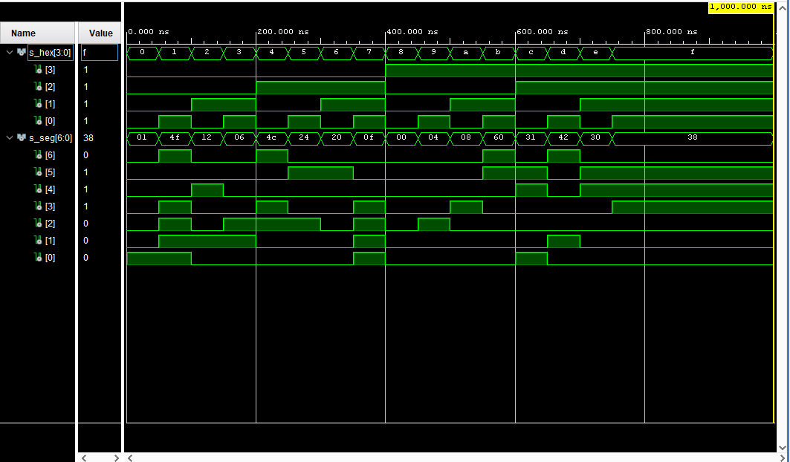

# Lab 4

## Preparation tasks (done before the lab at home)

The Nexys A7 board provides two four-digit common anode seven-segment LED displays (configured to behave like a single eight-digit display).

1. Schematic of the Nexys A7 board and connections of 7-segment displays, ie to which FPGA pins are connected and how.


2. Completed the decoder truth table for **common anode** 7-segment display.

   | **Hex** | **Inputs** | **A** | **B** | **C** | **D** | **E** | **F** | **G** |
   | :-: | :-: | :-: | :-: | :-: | :-: | :-: | :-: | :-: |
   | 0 | 0000 | 0 | 0 | 0 | 0 | 0 | 0 | 1 |
   | 1 | 0001 | 1 | 0 | 0 | 1 | 1 | 1 | 1 |
   | 2 | 0010 | 0 | 0 | 1 | 0 | 0 | 1 | 0 |
   | 3 | 0011 | 0 | 0 | 0 | 0 | 1 | 1 | 0 |
   | 4 | 0100 | 1 | 0 | 0 | 1 | 1 | 0 | 0 |
   | 5 | 0101 | 0 | 1 | 0 | 0 | 1 | 0 | 0 |
   | 6 | 0110 | 0 | 1 | 0 | 0 | 0 | 0 | 0 |
   | 7 | 0111 | 0 | 0 | 0 | 1 | 1 | 1 | 1 |
   | 8 | 1000 | 0 | 0 | 0 | 0 | 0 | 0 | 0 |
   | 9 | 1001 | 0 | 0 | 0 | 0 | 1 | 0 | 0 |
   | A | 1010 | 0 | 0 | 0 | 1 | 0 | 0 | 0 |
   | b | 1011 | 1 | 1 | 0 | 0 | 0 | 0 | 0 |
   | C | 1100 | 0 | 1 | 1 | 0 | 0 | 0 | 1 |
   | d | 1101 | 1 | 0 | 0 | 0 | 0 | 1 | 0 |
   | E | 1110 | 0 | 1 | 1 | 0 | 0 | 0 | 0 |
   | F | 1111 | 0 | 1 | 1 | 1 | 0 | 0 | 0 |

### Seven-segment display decoder

1. Listing of VHDL stimulus process from testbench file (`tb_hex_7seg.vhd`) with asserts:

```vhdl
    p_stimulus : process
    begin
        report "Stimulus process started" severity note;

        s_hex <= "0000"; wait for 50 ns;
        assert (s_seg = "0000001")
        report "Input combination 0000 FAILED" severity error;
        s_hex <= "0001"; wait for 50 ns;
        assert (s_seg = "1001111")
        report "Input combination 0001 FAILED" severity error;
        s_hex <= "0010"; wait for 50 ns;
        assert (s_seg = "0010010")
        report "Input combination 0010 FAILED" severity error;
        s_hex <= "0011"; wait for 50 ns;
        assert (s_seg = "0000110")
        report "Input combination 0011 FAILED" severity error;
        s_hex <= "0100"; wait for 50 ns;
        assert (s_seg = "1001100")
        report "Input combination 0100 FAILED" severity error;
        s_hex <= "0101"; wait for 50 ns;
        assert (s_seg = "0100100")
        report "Input combination 0101 FAILED" severity error;
        s_hex <= "0110"; wait for 50 ns;
        assert (s_seg = "0100000")
        report "Input combination 0110 FAILED" severity error;
        s_hex <= "0111"; wait for 50 ns;
        assert (s_seg = "0001111")
        report "Input combination 0111 FAILED" severity error;
        s_hex <= "1000"; wait for 50 ns;
        assert (s_seg = "0000000")
        report "Input combination 1000 FAILED" severity error;
        s_hex <= "1001"; wait for 50 ns;
        assert (s_seg = "0000100")
        report "Input combination 1001 FAILED" severity error;
        s_hex <= "1010"; wait for 50 ns;
        assert (s_seg = "0001000")
        report "Input combination 1010 FAILED" severity error;
        s_hex <= "1011"; wait for 50 ns;
        assert (s_seg = "1100000")
        report "Input combination 1011 FAILED" severity error;
        s_hex <= "1100"; wait for 50 ns;
        assert (s_seg = "0110001")
        report "Input combination 1100 FAILED" severity error;
        s_hex <= "1101"; wait for 50 ns;
        assert (s_seg = "1000010")
        report "Input combination 1101 FAILED" severity error;
        s_hex <= "1110"; wait for 50 ns;
        assert (s_seg = "0110000")
        report "Input combination 1110 FAILED" severity error;
        s_hex <= "1111"; wait for 50 ns;
        assert (s_seg = "0111000")
        report "Input combination 1111 FAILED" severity error;

        report "Stimulus process finished" severity note;
        wait;
    end process p_stimulus;
```

2. Screenshot with simulated time waveforms:

   
