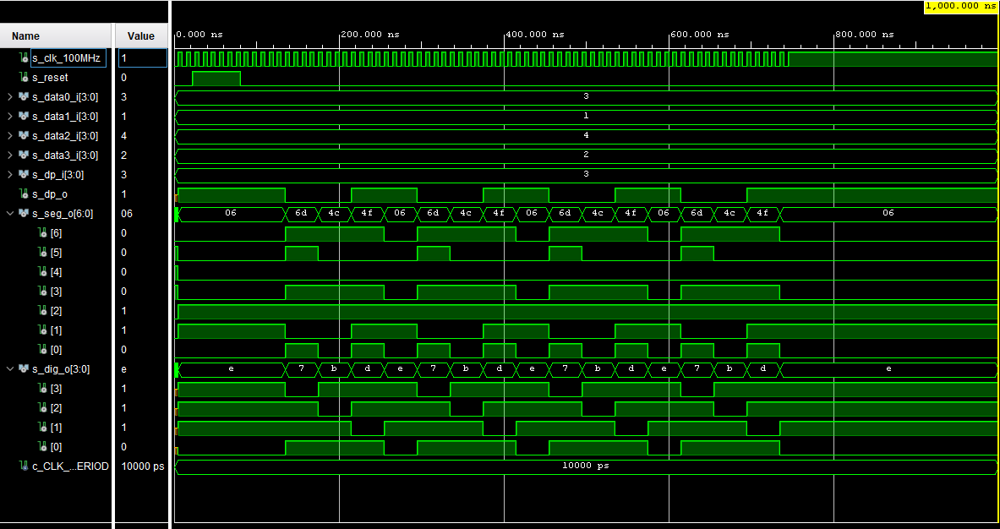

# Lab 7

## Preparation tasks (done before the lab at home)

A common way to control multiple displays is to gradually switch between them. We control (connect to supply voltage) only one of the displays at a time, as can be seen [here](https://engineeringtutorial.com/seven-segment-display-working-principle/).

Due to the physiological properties of human vision, it is necessary that the time required to display the whole value is a maximum of 16&nbsp;ms. If we display four digits, then the duration of one of them is 4&nbsp;ms. If we display eight digits, the time is reduced to 2&nbsp;ms, etc.

1. See [schematic](https://github.com/tomas-fryza/Digital-electronics-1/blob/master/Docs/nexys-a7-sch.pdf) or [reference manual](https://reference.digilentinc.com/reference/programmable-logic/nexys-a7/reference-manual) of the Nexys board, find out the connection of 7-segment displays, and complete the signal timing to display four-digit value `3.142`.


> The figure above was created in [WaveDrom](https://wavedrom.com/) digital timing diagram online tool. The figure source code is as follows:
>
```javascript
{
signal:
[
  ['Digit position',
    {name: 'Common anode: AN(3)', wave: 'xx01..01..01'},
    {name: 'AN(2)', wave: 'xx101..01..0'},
    {name: 'AN(1)', wave: 'xx1.01..01..'},
    {name: 'AN(0)', wave: 'xx1..01..01.'},
  ],
  ['Seven-segment data',
    {name: '4-digit value to display', wave: 'xx3333555599', data: ['3','1','4','2','3','1','4','2','3','1']},
    {name: 'Cathod A: CA', wave: 'xx01.0.1.0.1'},
    {name: 'Cathod B: CB', wave: 'xx0.........'},
    {name: 'CC', wave: 'xx0..10..10.'},
    {name: 'CD', wave: 'xx01.0.1.0.1'},
    {name: 'CE', wave: 'xx1..01..01.'},
    {name: 'CF', wave: 'xx1.01..01..'},
    {name: 'Cathod G: CG', wave: 'xx010..10..1'},
  ],
  {name: 'Decimal point: DP', wave: 'xx01..01..01'},
],
head:
{
  text: '                    4ms   4ms   4ms   4ms   4ms   4ms   4ms   4ms   4ms   4ms',
},
}
```

### Display driver

1. Listing of VHDL code of the completed process `p_mux`. Always use syntax highlighting, meaningful comments, and follow VHDL guidelines:

```vhdl
    p_mux : process(clk)
    begin
        if rising_edge(clk) then
            if (reset = '1') then
                s_hex <= data0_i;
                dp_o  <= dp_i(0);
                dig_o <= "1110";
            else
                case s_cnt is
                    when "11" =>
                        s_hex <= data3_i;
                        dp_o  <= dp_i(3);
                        dig_o <= "0111";

                    when "10" =>
                        s_hex <= data2_i;
                        dp_o  <= dp_i(2);
                        dig_o <= "1011";

                    when "01" =>
                        s_hex <= data1_i;
                        dp_o  <= dp_i(1);
                        dig_o <= "1101";

                    when others =>
                        s_hex <= data0_i;
                        dp_o  <= dp_i(0);
                        dig_o <= "1110";
                end case;
            end if;
        end if;
    end process p_mux;
```

2. Screenshot with simulated time waveforms. Test reset as well. Always display all inputs and outputs (display the inputs at the top of the image, the outputs below them) at the appropriate time scale!

   

### Eight-digit driver

1. Image of the 8-digit driver's block schematic. The image can be drawn on a computer or by hand. Always name all inputs, outputs, components, and internal signals!

   
